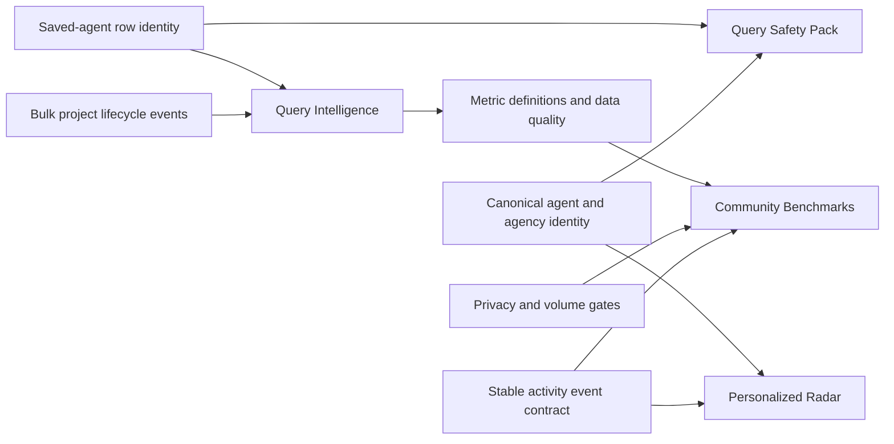

# Recommended Product Roadmap: Implementation Index

## Document status

- Deliverable: implementation-ready product and engineering specifications for the four recommended roadmap initiatives.
- Intended users: product owner, technical lead, and multiple AI coding agents working across the WQH Next.js repository, the canonical Flask/API repository, and the Supabase projects owned by those services.
- Planning date: 2026-07-31.
- Scope: planning only. These documents do not authorize production deployment, bulk email delivery, privacy-policy changes, or migrations in a backend repository that is not present in this workspace.
- Repository covered directly: `querybot_web_app`.
- External dependency: the WQH Flask/API service configured by `getWqhApiUrl()` owns writer projects, agent profiles, recent activity, messaging threads, lifecycle events, and the current agent-activity benchmark endpoint.

## Roadmap documents

1. [Query Safety Pack](./01-query-safety-pack.md)
   - Agency Query Guard
   - Query Rounds
   - Smart Reminders
2. [Personalized Radar](./02-personalized-radar.md)
   - Saved-agent watches
   - Targeted Dispatch
   - In-app reopening alerts
   - Email digests
3. [Query Intelligence](./03-query-intelligence.md)
   - Project timeline
   - Query funnel
   - Response-time analytics
   - Deterministic automatic insights
4. [Community Benchmarks](./04-community-benchmarks.md)
   - Privacy-preserving, agent-level aggregate response analytics
   - Productionization of the existing agent-activity prototype

## Recommended order

| Order | Initiative | Why it belongs here | Hard gate before the next stage |
| --- | --- | --- | --- |
| 1 | Query Safety Pack | Uses data WQH already stores and solves immediate writer mistakes with limited infrastructure. It also establishes canonical saved-agent and agency identity needed later. | Saved-agent row targeting and agency identity are stable. |
| 2 | Personalized Radar | Builds directly on the existing Dispatch feed and turns broad activity into personalized recurring value. | Activity events have stable event IDs and stable agent IDs; in-app delivery is reliable before email starts. |
| 3 | Query Intelligence | Reuses manual dashboard dates and canonical live lifecycle events. It needs the identity and event contracts established in stages 1 and 2. | Metric definitions are frozen, manual/live provenance is visible, and project-level bulk event reads avoid N+1 requests. |
| 4 | Community Benchmarks | Requires sufficient real event volume, privacy safeguards, and trustworthy aggregation. A partial UI prototype already exists, but it must not be treated as production-ready. | Privacy review, minimum cohort thresholds, production data readiness, deletion semantics, and removal of fixture injection are complete. |

Query Safety and the foundational event-contract work for Radar can overlap. Community Benchmarks must not launch early merely because some UI and TypeScript contracts already exist.

## Existing architecture that every implementer must preserve

### Authentication and entitlement

- Browser users authenticate through Clerk.
- App Route Handlers call `auth()` or server-side identity helpers; client-supplied user IDs are never trusted.
- Subscription state currently comes from Clerk metadata through `useClerkUser()` and server-side helpers.
- Product entitlements must be checked on the server for protected reads and mutations. Hiding a button is not authorization.
- Do not store email addresses redundantly in feature tables when a canonical Clerk/backend user identity is sufficient.

### Data ownership

WQH currently has two important persistence boundaries. Do not create competing sources of truth.

| Data | Canonical owner | Current access path |
| --- | --- | --- |
| Saved agents and manual dashboard fields | Next.js Supabase `agent_matches` | `/api/agent-matches` and `ProfileContext` |
| Writer projects and project traits | Flask/API service | `get-writer-projects` and related adapters |
| Agent profiles and submission status | Flask/API service | agent profile routes and `/recent-activity` |
| WQH message threads and lifecycle events | Flask messaging backend | `message-thread-data.ts` adapters |
| Live query timeline | Flask messaging backend | `/message-threads/{threadId}/timeline` |
| Current agent-activity comparison | Flask messaging backend | `/message-threads/{threadId}/agent-activity` |
| Per-user watches, reminders, and notification read state | Recommended: Next.js Supabase | New authenticated Route Handlers |
| Canonical activity/change event ledger | Recommended: Flask/API service | Versioned recent-activity contract |
| Community benchmark rollups | Recommended: Flask/messaging backend | New aggregate-only benchmark contract |

### Existing feature foundations

- `app/types.ts` defines saved-agent fields including project scope, agency, stage dates, notes, fit rating, and query readiness.
- `app/(writer-app)/query-dashboard/` contains table and board experiences for manual and live query tracking.
- `app/api/project-dashboard/export/route.ts` already generates authenticated XLSX exports.
- `app/api/dispatch-feed/route.ts` proxies the canonical `/recent-activity` feed.
- `app/utils/message-types.ts` already defines canonical lifecycle events, timeline responses, and an agent-activity comparison response.
- `app/(writer-app)/messages/[projectId]/threads/[threadId]/timeline/page.tsx` already renders a writer-facing live-query timeline and agent-activity panel.
- `app/components/messages/agent-activity.tsx` already implements privacy fallback copy and activity visualization.
- `app/utils/writer-agent-activity-test-data.ts` currently injects deterministic writer-facing activity lanes. This is fixture/prototype behavior and is a release blocker for real Community Benchmarks.

## Shared contracts to freeze before parallel implementation

### 1. Saved-agent identity

`agent_matches.id` is the canonical saved-agent row identifier. `index_id` identifies the underlying agent and may appear in more than one project.

New feature mutations must target the saved row ID or include a complete project scope. Do not add new mutations that update by `user_id + index_id` alone. The existing `app/api/agent-matches/[id]/route.ts` uses `index_id`; because WQH now permits the same agent in multiple projects, that route must be corrected or bypassed with an unambiguous row-targeted route before roadmap fields are added.

### 2. Project scope

Use one normalized scope key everywhere:

```text
writer:{trimmed writer_project_id}
```

When no writer project ID exists, use the legacy fallback:

```text
name:{lowercase normalized project_name}
```

The existing unique-index migration in `supabase/migrations/20260709000000_project_scoped_agent_matches_unique.sql` already uses this rule. Put the normalization in one shared utility and test it; do not reimplement it in each feature.

### 3. Agent identity

Preferred identity order:

1. Canonical agent profile ID from the Flask/API service.
2. Stable legacy/index ID already stored as `index_id`.
3. A documented migration-only alias mapping.

Names and email addresses are display data, not identity. Radar, analytics, and benchmarks must not join records by agent name.

### 4. Agency identity

Agency Query Guard needs a canonical `agency_id`. Until the upstream service exposes one, a fallback resolver may use a normalized agency URL/domain and normalized name, but it must expose confidence and preserve the original display name. A low-confidence fallback may show informational copy; it must not create a hard block.

### 5. Event identity and provenance

Every activity or query event used outside a single page render needs:

- a stable event ID;
- canonical agent identity;
- event type and schema version;
- occurrence timestamp and recorded timestamp;
- source/provenance;
- idempotency semantics;
- safe, display-ready summary fields;
- optional source URL that has been validated server-side.

Manual dashboard-derived events and live messaging events must retain distinct provenance. The UI may combine them, but must never imply that a manually entered date was confirmed by an agent.

### 6. Time semantics

- Query lifecycle events use UTC timestamps.
- User-selected reminder days are calendar dates in the user's declared timezone, not midnight UTC timestamps.
- Store both `due_on` and the timezone used to interpret it when scheduled delivery depends on local time.
- Metrics calculate durations from canonical timestamps and document whether they use elapsed 24-hour periods or calendar days.

## Cross-initiative dependency map



## Parallel-agent operating model

Each roadmap document defines bounded work packages. Use the following rules when assigning them:

1. Assign one agent as contract owner for each initiative. That agent updates the roadmap document whenever implementation changes a shared contract.
2. Freeze migrations and request/response types before UI agents code against them.
3. Give each coding agent explicit file ownership. Agents working in shared files such as `app/types.ts`, `app/utils/message-types.ts`, `app/utils/message-thread-data.ts`, and dashboard contexts must coordinate rather than overwrite one another.
4. Backend agents and Next.js agents may work concurrently only after the versioned wire contract and fixture examples are frozen.
5. UI agents may use fixtures, but fixture-only code must be explicitly gated and must not silently activate in production.
6. Every work package ends with tests or a verification artifact. “Component implemented” without authorization, failure, empty, loading, and mobile states is not complete.
7. Do not combine unrelated cleanup or navigation redesign with roadmap work.

## Suggested team allocation

| Track | Primary responsibility | Can run in parallel with |
| --- | --- | --- |
| Identity foundation | Saved-row route, project-scope utility, agent/agency identity contract | Product copy and fixture design |
| Safety backend | Query rounds/reminders persistence and guard APIs | Safety UI after contracts freeze |
| Radar backend | Stable activity events, watches, notification ledger | Watch-button UI using fixtures |
| Analytics backend | Unified events, metric engine, project aggregate endpoint | Analytics UI using frozen response fixtures |
| Messaging backend | Bulk lifecycle reads and benchmark rollups | Next.js adapters after contract freeze |
| UI/UX | Dashboard, agent cards, Dispatch, notification center | Backend work with fixtures |
| Privacy/QA | Threat model, cohort thresholds, adversarial and authorization tests | All stages; final veto on benchmark release |

## Global release gates

Every initiative must satisfy these gates before general availability:

- Authorization tests prove one Clerk user cannot read or mutate another user's saved-agent, reminder, watch, notification, or project analytics data.
- Server-side entitlement checks match the intended free/premium boundary.
- Error, loading, empty, partial-data, and stale-data states are designed and tested.
- Date/time behavior is tested across timezone and daylight-saving boundaries.
- User-visible analytics include provenance and do not overstate causation or certainty.
- New scheduled jobs are idempotent, retryable, observable, and protected by a server-only credential.
- Email work includes unsubscribe/preferences, bounce/complaint handling, and duplicate-send prevention.
- PostHog or the approved analytics system records feature adoption without including manuscript text, reminder notes, message bodies, or other user-authored content.
- Accessibility checks cover keyboard interaction, focus order, screen-reader labels, non-color indicators, and reduced motion.
- Rollout is guarded by a server-controlled feature flag or entitlement, not only a client constant.

## Program-level definition of done

The roadmap program is complete when:

1. A writer is warned about relevant same-agency query history before making an avoidable submission mistake.
2. A writer can organize a query sequence and receive reliable, user-controlled reminders.
3. A writer can watch saved agents and see a targeted, deduplicated activity feed; premium users can opt into a compliant digest.
4. A writer can understand a project's query history, funnel, response times, and evidence-backed next actions across manual and live queries.
5. Eligible agents expose privacy-preserving community aggregates only after server-enforced cohort thresholds; ineligible agents reveal no community details.
6. Fixture data cannot appear in production analytics.
7. The system has monitoring, deletion, retry, and rollback procedures appropriate to each feature.
